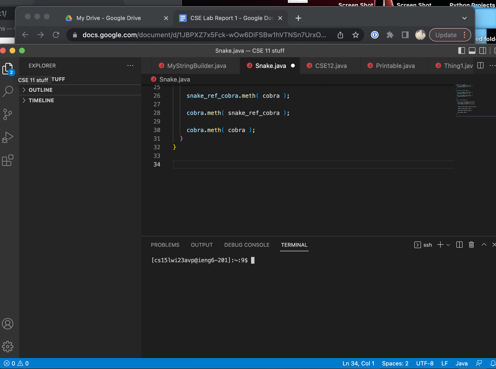
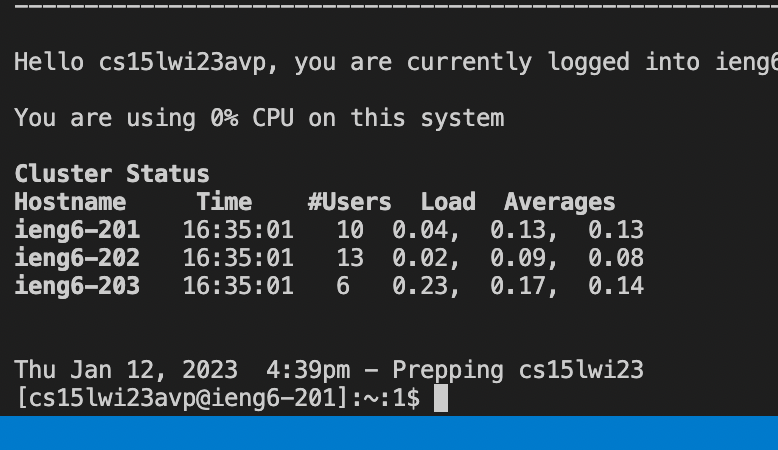
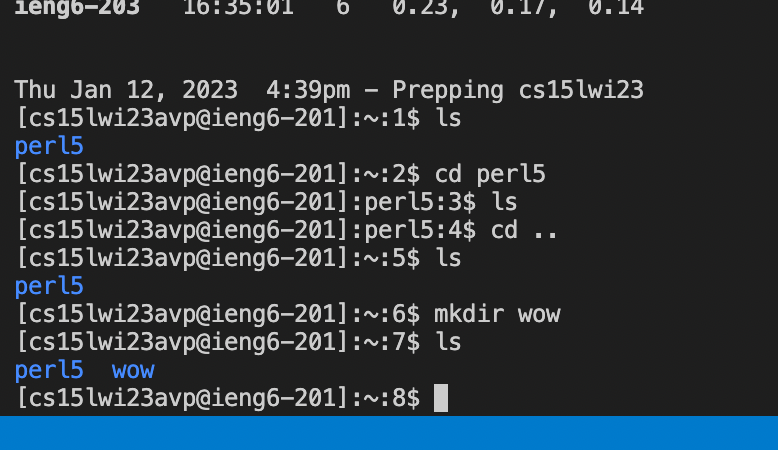

# How to Log onto ieng6 Account
## By Ishaan Kale

First, install [VSCode](https://code.visualstudio.com/download) on whatever platform you are on. Once installed, it
should be easy to access the directories within your computer and write code.
It also has a built-in terminal which we will be using to remote connect.
(terminal can be opened using control ` on mac)


Then, click [here](https://sdacs.ucsd.edu/~icc/index.php) and then follow the
instructions to find the account username and reset your password. Once the password is
reset, wait a little while, and then type in ```ssh cs15lwi23**@ieng6.ucsd.edu``` into the
VScode terminal where ```**``` is the last 3 digits of your username found at the website
shown above. Follow the instructions on the terminal, and you will end up remotely
logging in! It should look like this:


Using this remote connection, you can traverse and alter the directory system of the
computer you are connected to. Using cd, ls, mkdir, etc… play around with commands and
see what you can do to the given directory.

