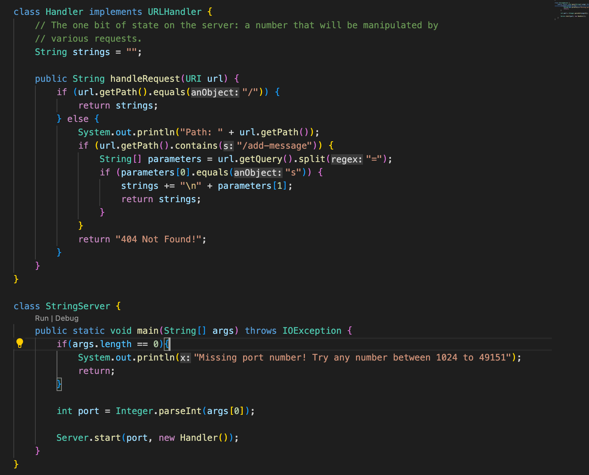
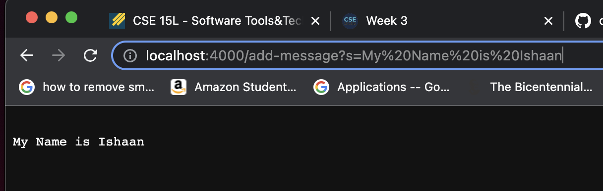
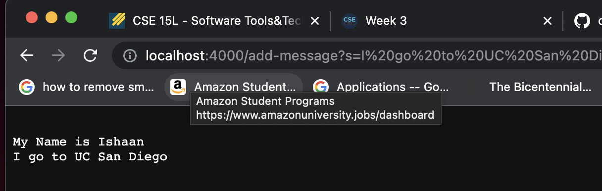
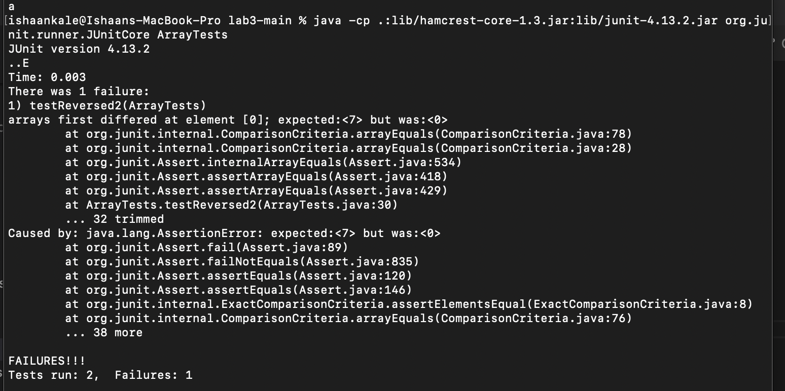

# Lab Report 2
## By Ishaan Kale

### Part 1

In part 1 I was tasked to write a web server that takes in string requests which are then added
to a page separated by newlines.

This was the code I came up with:


I then started the web server with port 4000, which if you refer back to the main function,
it runs "Server.start" with the port number and a new instance of the "Handler" class.

The Handler class contains one method called "handleRequest", which is what will be used
in the following string requests. The only class variable is called "strings", which holds the
data stored from requests and is initially set to an empty string.

Usage 1:


The request shown above calls the "handleRequest" method, which begins by checking the path using url.getPath().
The part of the code relevant to our request is when it checks if the path has "add-message". That following chunk of 
code in the if will be run. It then gets the query (which is the part of the path after the ?), which is
"s=My Name is Ishaan". It splits the query by the equal sign and creates a 2 string array called "parameters".
It then checks the type of query, which is signified by the first parameter "s". This is the correct type of request,
so as a result the second parameter is appended to the "strings" variable along with a newline.

Usage 2:


This request also calls the "handleRequest" method, and since the entire path is the same besides the second
query parameter (the part added to the "strings" variable"), handleRequest does the exact same thing but with a
different string appended to "strings". The path of the URL determines all of the functionality of handleRequest,
and since the path of the URL is mostly the same, the path taken inside the method will be very similar as well
(same add-message block, same s request type).


Part 2:

This is the buggy program:

```
static int[] reversed(int[] arr) {
    int[] newArray = new int[arr.length];
    for(int i = 0; i < arr.length; i += 1) {
      arr[i] = newArray[arr.length - i - 1];
    }
    return arr;
  }
 
```

This is the JUnit test that has a failure inducing input:
```
public void testReversed2() {
    int[] input1 = { 4, 5, 6, 7};
    assertArrayEquals(new int[]{ 7, 6 ,5 ,4 }, ArrayExamples.reversed(input1));
  }
  
```

This is the JUnit test that has an input that doesn't induce a failure:

```
 public void testReversed() {
    int[] input1 = { };
    assertArrayEquals(new int[]{ }, ArrayExamples.reversed(input1));
  }
```

I put those two tests in a single file and ran it. This was the output from the terminal:

