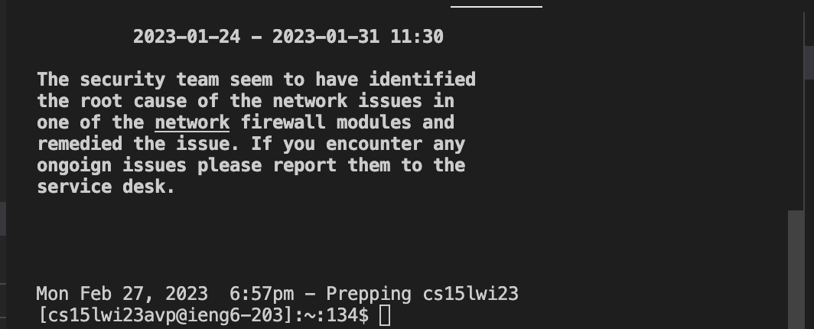

# Lab Report 4
## by Ishaan Kale

### Step 4

Type out ```ssh cs15lwi23avp@ieng6.ucsd.edu``` and ```\<enter\>``` in the terminal (there is no shortcut for this within the terminal). You can also find a reference and ```\<ctrl-c\>\<ctrl-v\>``` this statement.
I didn't have to type the password because of the earlier steps in the lab.



### Step 5

Go to your github, and copy (```\<ctrl-c\>```) the url for the forked repo. Then go to the terminal, type in 
```git clone \<ctrl-v\>```, which will paste the your forked repo. Then press ``` \<enter\>```.

### Step 6

Type ```ls``` and ```\<enter\>``` to check if the lab7 directory now exists. Then do ```cd l``` then ```\<tab\> \<enter\>```.
```ls``` and ```\<enter\>``` again to check the name of the test file, which is ```ListExamplesTests.java```.
Copy this command from the lab using ```\<ctrl-c\>```: ```javac -cp .:lib/hamcrest-core-1.3.jar:lib/junit-4.13.2.jar *.java```.
Then paste and enter in terminal (```\<ctrl-v\> \<enter\>```). This compiles the test.
To run it, copy command```java -cp .:lib/hamcrest-core-1.3.jar:lib/junit-4.13.2.jar org.junit.runner.JUnitCore```, add the file name without .java as an argument (```ListExamplesTests```), and paste and enter into terminal.
Specifically, I typed ```L\<tab\>T\<tab\>``` to get the argument faster.
This will run the tests and show that it fails.

### Step 7

Type ```nano L\<tab\>.java``` and ```\<enter\>``` to open the ```ListExamples.java``` file.
The error is in the last while loop in the merge function, so press ```\<down\>``` a lot of times until you get there.
When you find the ```index1 += 1;```, stop and press ```\<right\>``` until the cursor is just past the first "1".
then press ```\<delete\>``` and then add ```2``` to make it ```index2 += 1;```. This will fix the bug. To save and exit,
press ```\<ctrl-o\> \<enter\>``` and then ```\<ctrl-x\>```. 

### Step 8

To compile the file again, press ```\<up\>``` 3 times, as the command ```javac -cp .:lib/hamcrest-core-1.3.jar:lib/junit-4.13.2.jar *.java``` the 3rd last command ran. 
Then, to run the test file again, do ```\<up\>``` 3 times, as the command ```java -cp .:lib/hamcrest-core-1.3.jar:lib/junit-4.13.2.jar org.junit.runner.JUnitCore ListExamplesTests``` is now the 3rd last one.

### Step 9


